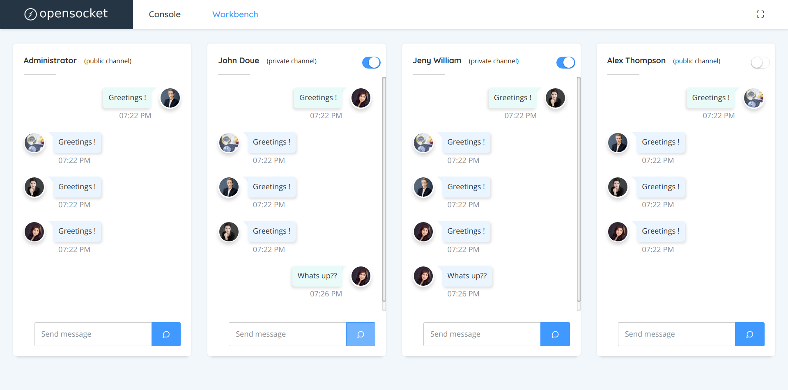

# opensocket

Sanic - SocketIO startup kit.



## Getting started
Clone the repo, followup the steps:

1. Configure database and server host settings in  ```webconsole/main/settings.py```

1. ``` pip install -r requirements``` - Installs required python packages

1. ```python manage.py migrate``` - Updates database schema

1. To start server run ```python manage.py runserver```

Open http://localhost:8000 to view webconsole


Note:
You may need to install ```mysql/sqlite3``` server depends on database that you are using.

### Sources
[sanic](https://sanic.readthedocs.io/en/latest/)

[python-socketio](https://python-socketio.readthedocs.io/en/latest/)

### References

[python-sokcetio](https://github.com/miguelgrinberg/python-socketio) - Example implementations of python-socketio for various deployment methods

[sanic-starter](https://github.com/seanpar203/sanic-starter) - sanic starter with [alembic](https://alembic.sqlalchemy.org/en/latest/) migration